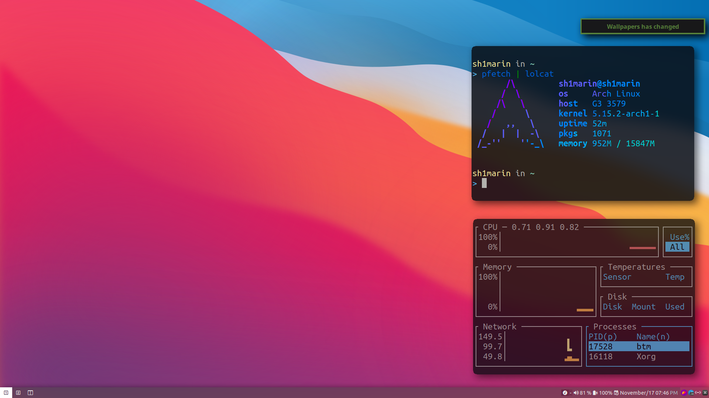

# SDWM

My attempt to make DWM focus on the "WM".



## Feature

- Lightweight and portable
- Trasnparent systray
- No annoying title
- Hide tag when no windows use them
- Full nerd font icon
- Out of the box
- Status text support colors
- Hide and restore windows feature (You can use it like a scratchpad)

 

## Usage

- build

Changed the home path in `Makefile` and config.def.h. Then run command to built it:

```console
$ sudo make clean install
```

- Scripts

I've write some script to automatically run when dwm start up, checkout the
`$HOME/.local/share/dwm` directory.

## Customize

Modified file `config.def.h`

## Patches

```text
dwm-alpha-20201019-61bb8b2.diff
dwm-fullgaps-toggle-20200830.diff
dwm-notitle-20210715-138b405.diff
dwm-autostart-20210120-cb3f58a.diff
dwm-pertag-20200914-61bb8b2.diff
dwm-status2d-20200508-60bb3df.diff
dwm-viewontag-20210312-61bb8b2.diff
dwm-systray-20210418-67d76bd.diff
dwm-hide_vacant_tags-6.2.diff
dwm-fullscreen-6.2.diff
```

## Keymap

Mod key is Win key.

```text
Mod + [1-9]:         Select workspace [1-9]

Mod + o:             Open dmenu
Mod + Shift + Enter: Open Terminal
Mod + Shift + s:     Open flameshot
Mod + Shift + b:     Change background
Mod + Shift + u:     Volume up
Mod + Shift + d:     Volume down
Mod + Shift + e:     Open up a shutdown script
Mod + Shift + q:     Kill program
Mod + Shift + c:     Kill dwm(log out)
Mod + Shift + 0:     View all pages

Mod + =:           Increase gaps
Mod + -:           Decrease gaps
Mod + Shift + -:   Toggle gaps
Mod + Shift + =:   Reset gaps

Mod + b:             Toggle bar
Mod + Space:         Switch last two layout
Mod + Shift + Space: Toggle floating windows aka reset windows size
Mod + t:             Toggle tilling layout
Mod + m:             Toggle fullscreen layout
Mod + f:             Toggle floating layout
Mod + Shift + f:     Toggle fullscreen layout
Mod + Enter:         Set current windows as master

Mod + w:           Hide window
Mod + Shift + w:   Pop out hided window
Mod + j/k:         Focus around shown windows
Mod + i/d:         Toggle horizon split or vertical split
```

Mouse are also supported

- Windows will focus on mouse
- Press `Mod` and use mouse to drag windows
- Press `Mod+Shift` and the left click to resize windows.

## Dependency

Fallback fonts: `UbuntuMono Nerd Font Mono`

Also you may want feh to change background, and picom to add blur transparency.

## Credit

Original dwm: https://dwm.suckless.org

The hide and restore windows is copy from
[theniceboy/hide-and-restore](https://github.com/theniceboy/dwm-hide-and-restore-win.diff/blob/master/dwm-hide-and-restore.diff)
and
[awesomebar](https://dwm.suckless.org/patches/awesomebar/)

## License

MIT License

All rights reserved to the suckless team
