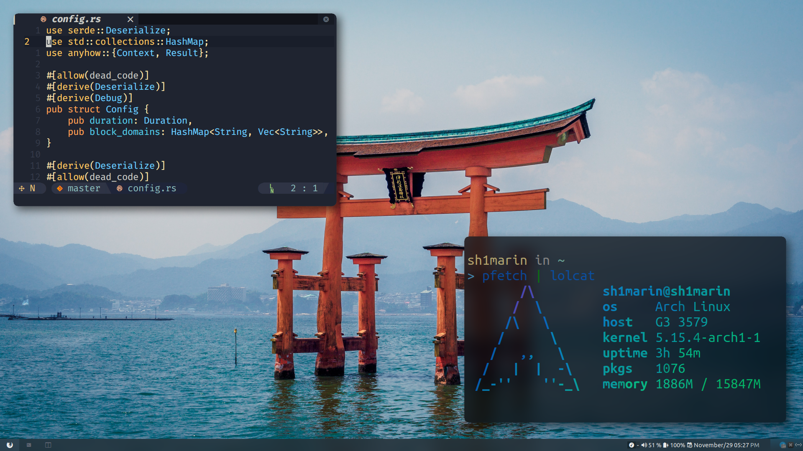
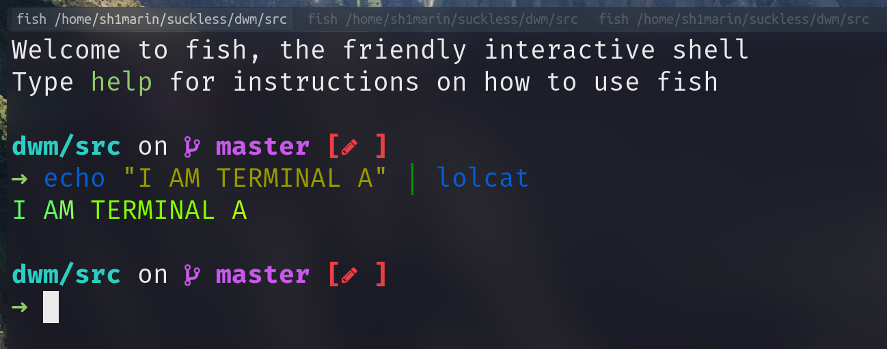

# SDWM

My attempt to make DWM focus on the "WM".



## Feature

- Lightweight and portable
- Trasnparent systray
- Lot's of useful scripts
	- Song control
		
	- Power control
		

- No annoying title
- Hide tag when no windows use them

	 

- Full nerd font icon
- Out of the box
- Status text support colors (see [siduck76/chadwm](https://github.com/siduck76/chadwm/blob/main/.dwm/bar#L8) for color example)

 

- Hide and restore windows feature (You can use it like a scratchpad)

https://user-images.githubusercontent.com/30021675/128586163-d86e37dc-fcec-4a0f-8f71-6ff5ca8dc941.mp4

- Tab support

 

https://user-images.githubusercontent.com/30021675/129058318-837367f1-5796-42cd-81ee-96dd474b9b93.mp4

## Usage

- build

Changed the home path in `Makefile` and config.def.h. Then run command to built it:

```console
# Change my username to your name 
sed -i 's/sh1marin/YOURNAME/g' src/config.def.h src/Makefile

# Build 
sudo make clean install

# Copy script
cp scripts/* ~/.local/share/dwm
```

- Scripts

I've write some script to automatically run when dwm start up, checkout the
`$HOME/.local/share/dwm` directory.

## Customize

Modified file `config.def.h`

## Keymap

Mod key is Win key.

```text
Mod + [1-9]:         Select workspace [1-9]

Mod + o:             Open dmenu
Mod + Shift + Enter: Open Terminal
Mod + Shift + s:     Open flameshot
Mod + Shift + b:     Change background
Mod + Shift + u:     Volume up
Mod + Shift + d:     Volume down
Mod + Shift + e:     Open up a shutdown script
Mod + Shift + q:     Kill program
Mod + Shift + c:     Kill dwm(log out)
Mod + Shift + 0:     View all pages

Mod + =:           Increase gaps
Mod + -:           Decrease gaps
Mod + Shift + -:   Toggle gaps
Mod + Shift + =:   Reset gaps

Mod + b:             Toggle bar
Mod + Space:         Switch last two layout
Mod + Shift + Space: Set current window as floatin window
Mod + t:             Toggle tilling layout
Mod + m:             Toggle monocle layout (Tab page support)
Mod + f:             Toggle floating layout
Mod + Shift + f:     Toggle fullscreen layout
Mod + Enter:         Set current windows as master

Mod + w:           Hide window
Mod + Shift + w:   Pop out hided window
Mod + j/k:         Focus around shown windows
Mod + i/d:         Toggle horizon split or vertical split
```

Mouse are also supported

- Windows will focus on mouse
- Press `Mod` and use mouse to drag windows
- Press `Mod+Shift` and the left click to resize windows.

## Dependency

Fallback fonts: `UbuntuMono Nerd Font Mono`

Also you may want feh to change background, and picom to add blur transparency.

## Credit

Original dwm: https://dwm.suckless.org

The hide and restore windows is copy from
[theniceboy/hide-and-restore](https://github.com/theniceboy/dwm-hide-and-restore-win.diff/blob/master/dwm-hide-and-restore.diff)
and
[awesomebar](https://dwm.suckless.org/patches/awesomebar/)

The tab in monocle layout is copy from
[siduck76/chadwm](https://github.com/siduck76/chadwm).

## Issues

Currently, the tab color will be drawn to the status bar when you switch to mococle layout.
Track the issue in [#4](https://github.com/Avimitin/sdwm/issues/4).

Systray shadow can be disabled by `WM_CLASS: "dwmsystray"` filter. For example if you are
using picom as compositor, add below into your picom.conf file:

```text
shadow-exclude = [
  "class_g = 'dwmsystray'",
];
```

## License

MIT License

All rights reserved to the suckless team
